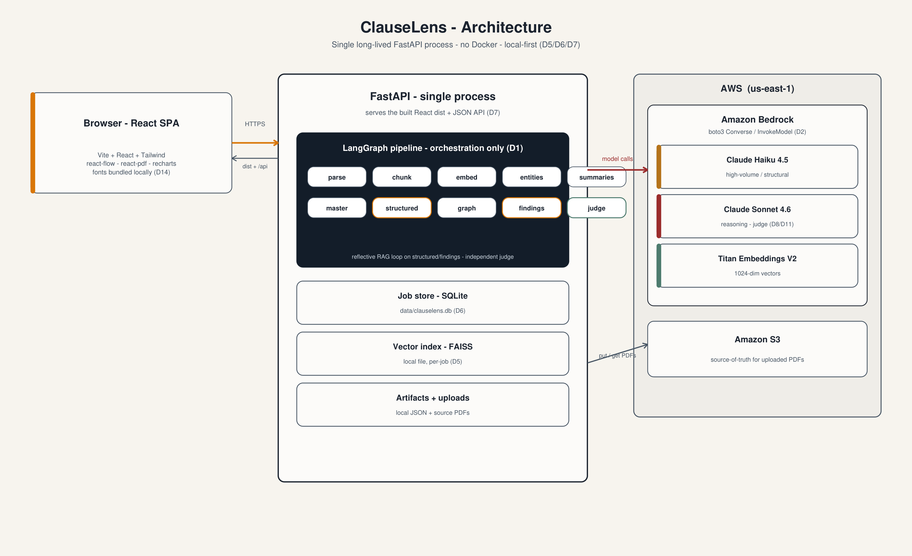
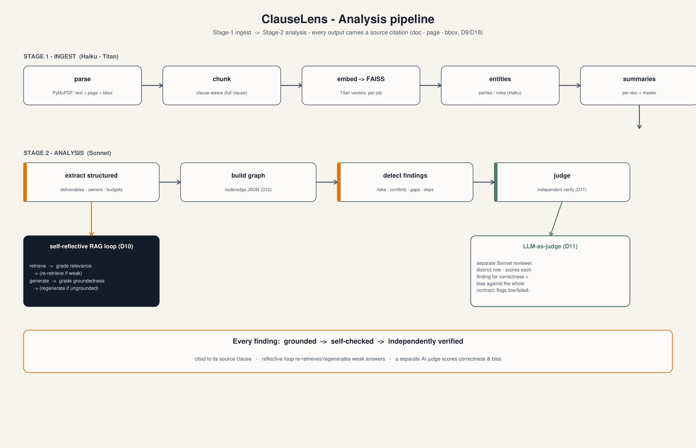

<h1 align="center">ClauseLens</h1>

<p align="center"><em>Contract & clause analyzer — every risk, gap, conflict, deliverable, owner, and
dependency traced back to a cited source clause.</em></p>

ClauseLens ingests contract PDFs and surfaces what matters to a reviewer — with
**every output traceable to a cited source clause**, self-checked by a reflective
RAG loop, and independently verified by an LLM-as-judge. It is a proof-of-concept
and technology demonstrator for an "AI for Leaders" capstone.



## What it does

- **Ingest** contract PDFs → clause-aware chunks with page + bounding-box provenance (PyMuPDF).
- **Extract** parties, roles, deliverables, owners, budgets, and timelines — each cited.
- **Detect** risks, conflicts, gaps, and dependencies across the whole contract (and across
  multiple documents), then **judge** each finding for correctness and bias.
- **Explain** everything: click any citation to highlight the exact clause in the source PDF;
  explore the entity-relationship graph; inspect per-call cost/latency on the Admin page.

The assurance story, made legible on every finding:
**grounded → self-checked → independently verified**.


## Tech stack

Python 3.10+ · FastAPI (single process) · LangGraph (orchestration only) ·
AWS Bedrock via boto3 (Claude Haiku 4.5 + Claude Sonnet 4.6 + Titan Embeddings V2) ·
FAISS (local) · SQLite (local) · Vite + React + Tailwind (react-flow, react-pdf, recharts).
No Docker; one process serves the built React app and the API.

## Prerequisites

- **Python 3.10+** and **Node 18+** (Node is build-time only).
- **AWS credentials** with access to Bedrock + S3 in `us-east-1`, via a local profile
  (typically `aws sso login`). The app reads `config.env` at the repo root.
- **GNU Make** (optional but convenient — the manual commands are below if you don't have it).

## Run it (from a cold clone)

```sh
# 1. Configure AWS (one time): copy the template and fill in profile + bucket.
cp config.env.example config.env      # then edit AWS_PROFILE and S3_BUCKET
aws sso login --profile <your-profile>   # if you use SSO

# 2. Build the backend venv + install deps.
make backend

# 3. Build the frontend, seed the pre-baked demo analysis, and launch.
make demo
```

Then open **http://127.0.0.1:8000**. `make demo` is the single command used on stage.

<details>
<summary>Without <code>make</code> (manual equivalents)</summary>

```sh
# backend
python -m venv backend/.venv
backend/.venv/Scripts/python -m pip install -r backend/requirements.txt   # POSIX: backend/.venv/bin/python
# frontend
cd frontend && npm ci && npm run build && cd ..
# seed the pre-baked analysis
backend/.venv/Scripts/python scripts/seed_demo.py
# launch
backend/.venv/Scripts/python -m uvicorn app.main:app --app-dir backend --host 127.0.0.1 --port 8000
```
</details>

Other targets: `make backend`, `make build-frontend`, `make seed`, `make test`, `make clean`.

## The demo

1. **Open the pre-baked analysis first** (it loads instantly, no live call) — the
   *Software development agreement (sample)* in the analyses list. Walk the Findings,
   click a citation to highlight the clause, show the entity Graph, then the Admin
   cost/latency view.
2. **Then start a fresh live run** to prove it end-to-end: New analysis → upload the
   three PDFs in [`data/sample_contracts/software_dev/`](data/sample_contracts/software_dev/)
   as **one** analysis → Run. Watch the pipeline advance, then explore the result.

The four sample contracts (with deliberately planted issues) live under
[`data/sample_contracts/`](data/sample_contracts/); the test oracle is
[`ANSWER_KEY.md`](data/sample_contracts/ANSWER_KEY.md). The hero is the three-document
software-development set (it exercises cross-document reconciliation).

## Rehearsal checklist

Run through this shortly before presenting:

- [ ] `aws sso login --profile <profile>` (or confirm credentials are valid) — Bedrock + S3 expire.
- [ ] `./scripts/test_aws.sh` passes (live S3 + Bedrock connectivity).
- [ ] `make demo` from a clean checkout serves http://127.0.0.1:8000 with no manual steps.
- [ ] The **pre-baked analysis opens instantly** and its citations highlight the right clauses.
- [ ] A **fresh live run** of the hero `software_dev/` set completes and reproduces the
      `ANSWER_KEY.md` findings (each caught, cited, and judged).
- [ ] The **Admin** page shows a populated cost Sankey + latency table.
- [ ] Confirm `.claude/IMPLEMENTATION_LOG.md` is current (it is the authoritative state).
- [ ] Laptop on power, screen-sleep off, browser zoom sane, network reachable.

## Project layout

```
backend/app/        FastAPI app: routes, LangGraph pipeline, AWS clients, stores
frontend/src/       React SPA (New analysis · View analysis · Admin)
data/sample_contracts/   four sample contracts (md sources + rendered PDFs + ANSWER_KEY)
data/seed/          the pre-baked hero analysis (seeded into data/jobs/ by make demo)
docs/               architecture + flow diagrams (PNG/PDF + mermaid sources)
scripts/            md_to_pdf.py · seed_demo.py · make_diagrams.py · test_aws.sh
.claude/            standing context (CLAUDE.md) + the authoritative IMPLEMENTATION_LOG.md
```

## Troubleshooting

- **Blank page / 404 at `/`** — the frontend wasn't built. Run `make build-frontend` (or `make demo`).
- **A job goes to `error` or `partial`** — a Bedrock call failed mid-run; the job records a
  clear message and preserves whatever completed (it never hangs). Re-check credentials, then re-run.
- **No pre-baked analysis in the list** — run `make seed` (or `python scripts/seed_demo.py`).
- **Pricing on the Admin Sankey looks off** — verified per-1K rates live in `backend/app/pricing.py`.
